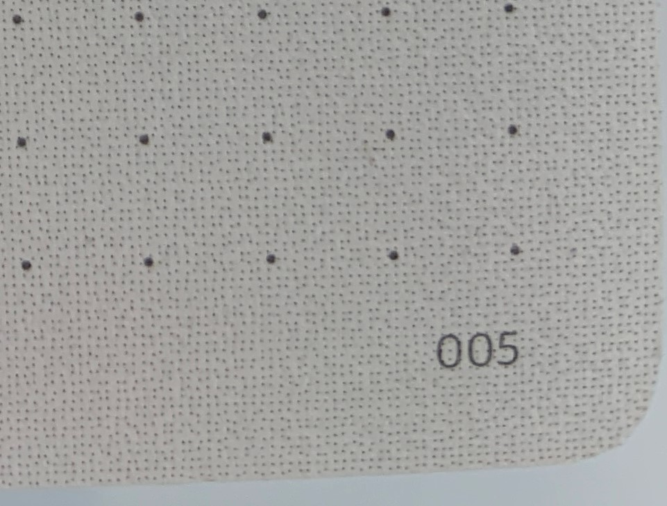
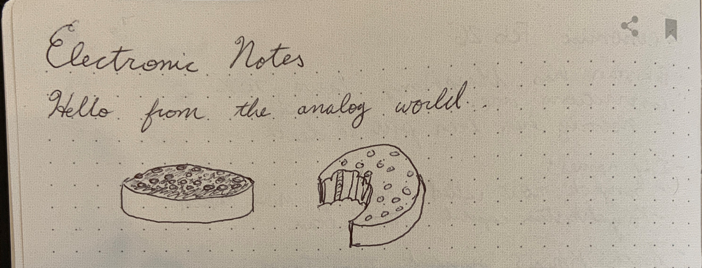
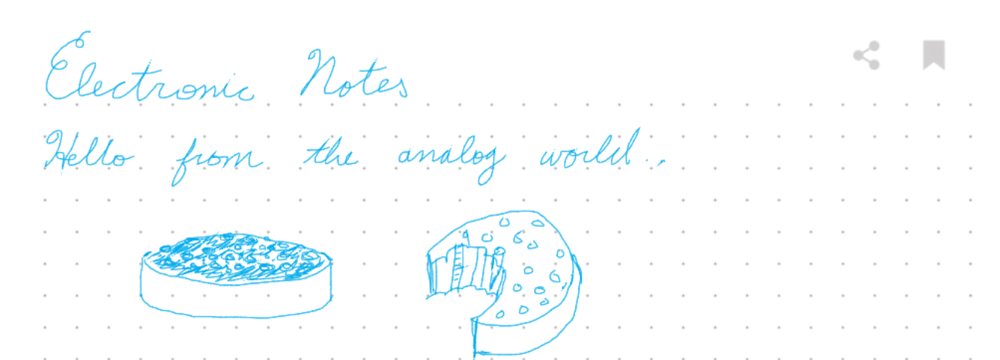

As I was reading a bunch of the Economist (TODO: figure out how to link easily between articles...), I started keeping notes in logseq (TODO: also link there, I think I wrote something?).  And I used some spaced-repitition to remember the facts (inconsistently to be honest, but I got some usage out of it.  I can now remember reliably the new prime minister of Bulgaria (although I forgot it when I was chatting about it with a co-worker recently)).

One of the downsides of this is that I'm often reading the Economist before bed.  That means I don't have a computer near me, and I also don't want to stare at a computer screen.  The ways I was taking notes were either to scribble things on a scratch pad and write them up later, or periodically browse the Economist website for articles I had already read, and jotting some notes down I remembered.

I was talking about this with my partner which lead to a birthday gift of "Lamy x NeoLab" notebook with a smart pen.  It's a pretty wild piece of technology that uses a ball point pen and notebook, but then also is able to store the notes electronically as you write them and sync them with your phone via bluetooth.  The way it captures the notes is the coolest part in my opinion.  It has a camera in the pen, and the paper has a special pattern on it.  That means that when I write in a particular page in my notebook, it knows exactly which page I've written on, and will sync it with whatever else is stored.

I wanted to experiment with what it would be like to handwrite something and then post it on here.  Some ideas:
- Try out some different CSS patterns to make this look more like a notebook
- Closely examine the pattern in the paper to see if I can make sense of how it works its magic
- Draw some things on the notebook, and sync them here
- Compare the capture notes with a photograph of the page

There are some other angles on notes that I'd like to think more about:
- Different axes of value from notes
    - Ephemeral vs. reference
    - Self-reflection
    - Enjoyment while writing vs. while reading later
    - Editability
    - Ease of finding later
    - Durability / offline vs. backed-up

